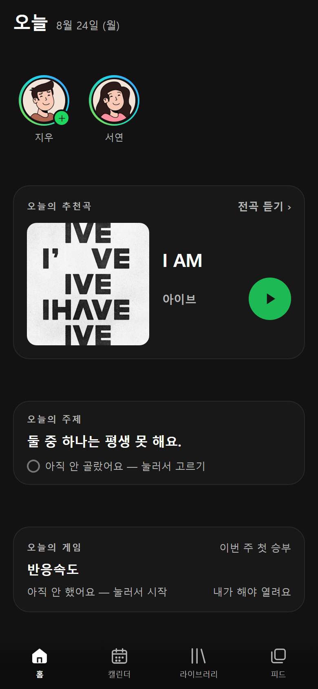
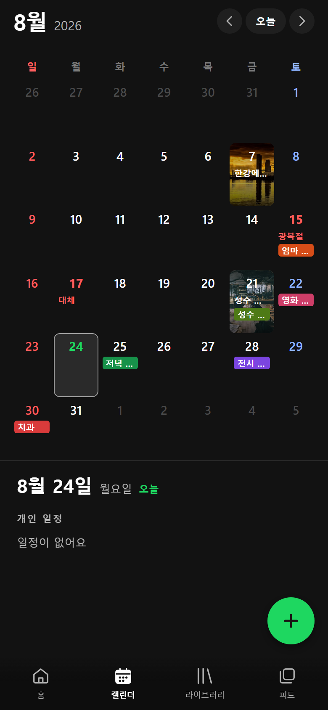
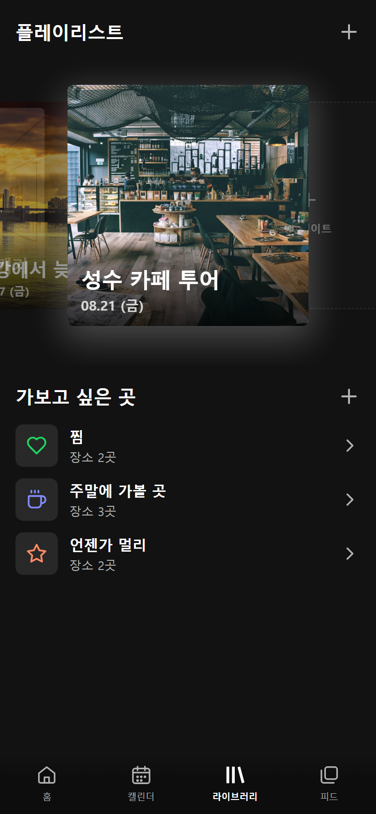
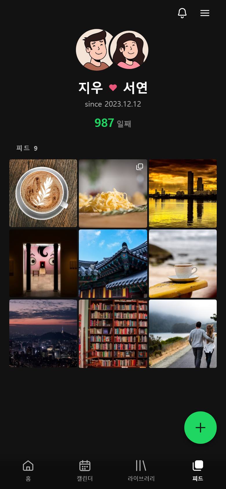

<div align="center">
  
  <h1>도돌이 · dodori</h1>
  <p>커플 둘이 매일 여는 하나의 공용 공간</p>
  <p>
    <a href="https://dodori.vercel.app">웹에서 열기</a> ·
    <a href="https://dodori.vercel.app/demo">둘러보기(데모 계정)</a>
  </p>
</div>

---

두 사람이 커플 하나로 묶이면 그때부터 모든 게 공용이 됩니다. 캘린더도 하나, 사진첩도 하나,
올린 글도 하나예요. "내 것을 상대에게 공유한다"가 아니라 처음부터 둘의 공간에 쌓는 구조라,
누가 넣었든 상대 폰에서 곧바로 보입니다.

음악 메타포로 이름이 붙어 있습니다. 장소는 **트랙**, 하루(데이트)는 **앨범**, 시간순으로 늘어선
우리 데이트가 **플레이리스트**예요. 로고인 여는 도돌이표 𝄆 도 거기서 왔습니다.

|  홈  |  캘린더  |  라이브러리  |  피드  |
| :--: | :------: | :----------: | :----: |
|  |  |  |  |

## 무엇을 하는 앱인가

- **홈** — 오늘의 주제·추천곡·게임. 셋 다 **내가 먼저 해야 상대 답이 열립니다.**
- **캘린더** — 둘의 일정을 같이 잡습니다. 여러 날 일정은 구글 캘린더처럼 셀 위를 가로지르는 막대로,
  공휴일은 규칙으로 계산해서 표시합니다(음양력 변환·대체공휴일 포함)
- **라이브러리** — 다녀온 하루는 사진과 코스가 붙은 앨범 한 장으로, 가보고 싶은 곳은 찜 목록으로
- **피드** — 게시물과 24시간 스토리. 사진과 15초 동영상을 올립니다

iOS·안드로이드 앱과 웹이 같은 코드로 돌아가고, 웹은 홈 화면에 추가하면 앱처럼 뜹니다(PWA·웹 푸시).

## 스택

Expo SDK 57 · React Native 0.86 · TypeScript(strict) · expo-router
· Supabase(Auth/Postgres/Storage/Realtime/Edge Functions) · TanStack Query · Vercel · Sentry

백엔드 서버는 따로 없습니다. 규칙은 Postgres(RLS·트리거·RPC)와 Edge Function이 들고 있고,
앱은 그 앞단입니다. 스타일은 RN `style` + 토큰(`src/theme/tokens.ts`) — 색은 전부 토큰 참조입니다.

## 구조

```
src/
  app/        expo-router 파일 라우팅 — (auth) / (tabs)/{home,calendar,playlist,feed} / …
  components/ 표현만 (props-only)
  api/        Supabase 접근 · TanStack Query 훅
  lib/        순수 함수 — 날짜·기념일·공휴일·일정 기하 계산. 유일한 단위 테스트 대상
  theme/      디자인 토큰
supabase/
  migrations/ 스키마 (원격에 그대로 적용)
  functions/  Edge Functions
api/          Vercel Function (웹 푸시 발송 워커)
```

의존성 방향은 `app/ → components/ → api/·lib/ → theme/·types/` 한 방향입니다.
`lib/`은 React·Supabase·RN을 import하지 않고, 화면은 `supabase`를 직접 부르지 않습니다.

## 개발

```bash
npm install
cp .env.example .env      # 값을 채웁니다 (원격 Supabase에 바로 붙습니다)

npm run web               # 브라우저
npx expo run:android      # dev client — 카카오 로그인은 Expo Go에서 안 됩니다
npx expo run:ios

npm test                  # lib 단위 테스트
npm run typecheck         # tsc strict
```

DB 스키마를 고쳤다면:

```bash
npx supabase db push
npx supabase gen types typescript --linked > src/types/database.types.ts
```

작업 규칙과 설계 배경은 [`CLAUDE.md`](CLAUDE.md), 기능별 설계 문서는
[`docs/superpowers/specs/`](docs/superpowers/specs/)에 있습니다.

## 라이선스

[MIT](LICENSE)
