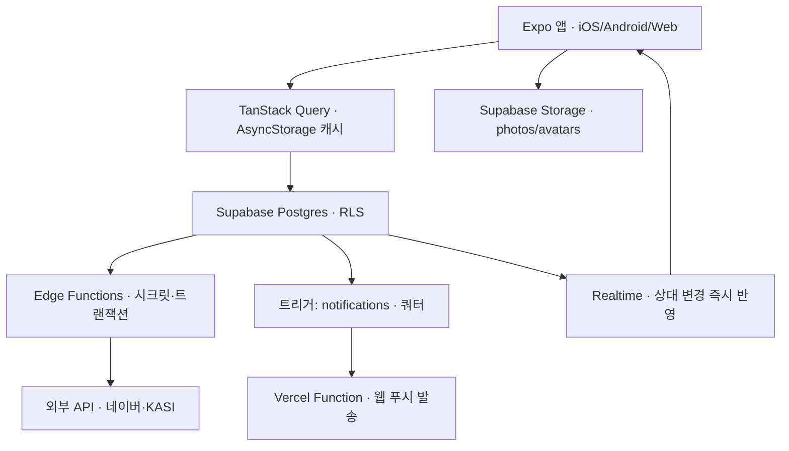

## 제품 소개

두 사람이 커플 하나로 묶이면 그때부터 모든 게 공용이 됩니다. 캘린더도 하나, 사진첩도 하나,
올린 글도 하나예요. "내 것을 상대에게 공유한다"가 아니라 처음부터 둘의 공간에 쌓는 구조라,
누가 넣었든 상대 폰에서 곧바로 보입니다.

앱을 열면 홈에 오늘 것 세 개가 있어요. 오늘의 주제(둘 중 하나 고르는 논쟁거리), 오늘의
추천곡, 오늘의 게임. 셋 다 **내가 먼저 해야 상대 답이 열립니다.** 캘린더에서 다음 데이트를
잡고, 라이브러리에 가보고 싶은 곳을 쟁여두고, 다녀온 하루는 사진과 코스가 붙은 앨범 한 장으로
남아요. 피드에는 게시물과 24시간 스토리가 쌓입니다.

음악 메타포로 이름이 붙어 있습니다. 장소는 트랙, 하루(데이트)는 앨범, 시간순으로 늘어선
우리 데이트가 플레이리스트예요. 로고인 여는 도돌이표 𝄆 도 거기서 왔습니다.
iOS·안드로이드 앱과 웹에서 같은 코드로 돌아가고, 웹은 홈 화면에 추가하면 앱처럼 뜹니다.

## 기획

**문제** 연인과 일정을 공유하고 데이트를 같이 계획하고 스토리나 피드를 우리끼리 올릴 수 있는 그런 서비스를 원했어요
**문제** 일정은 카톡에, 사진은 각자 갤러리에, 가보고 싶은 곳은 인스타 저장함에 흩어져 있었어요
**사용자** 저와 연인 둘. 하루에 몇 번씩 짧게 들어와요
**넣지 않은 것** 수익화. 사용량 게이트는 가장 열심히 쓰는 소수에게만 청구서를 보내면서 총액은 얼마 안 되는 구조라 접었어요
**넣지 않은 것** 색으로 사람 구분(나=초록/상대=분홍). 같이 화면을 보면 보는 사람마다 반대로 읽혀서 혼선이 됐어요
**넣지 않은 것** 실시간 동시 대결. 접속 타이밍이 안 맞으면 죽는 기능이라 비동기 점수 승부로 충분했어요
**넣지 않은 것** 대댓글. 참여자가 둘뿐이라 트리 구조가 생길 일이 없어요

## 구상

- [x] 일정을 둘이 같은 캘린더에서 잡는다
- [x] 다녀온 하루가 사진·코스가 붙은 앨범 한 장으로 남는다
- [x] 가보고 싶은 곳을 쟁여두고 다음 데이트 코스로 꺼내 쓴다
- [x] 사진을 둘만 보는 곳에 올린다
- [ ] 앱스토어·플레이스토어에 올려서 우리 말고도 쓴다

## 화면

### 홈

**파일** ./screens/01-home.png

### 캘린더

**파일** ./screens/02-calendar.png

### 라이브러리

**파일** ./screens/03-playlist.png

### 데이트 앨범

**파일** ./screens/05-track.png

### 피드

**파일** ./screens/04-feed.png

## 유저 플로우

### 카카오로 들어와 상대를 초대한다

먼저 들어온 쪽이 초대 코드를 받고, 링크로 넘깁니다.

**갈라짐** 링크를 눌렀다 → 코드 없이 바로 수락 / 링크가 막혔다 → 코드 열 자를 직접 입력

### 사귄 날을 정하고 커플이 된다

이때 D-day와 기념일이 한 번에 생성됩니다.

### 홈에서 오늘의 주제를 고른다

선택지 둘 중 탭 한 번. 3초면 끝나요.

**갈라짐** 내가 골랐다 → 상대 답이 열리고 댓글로 논쟁 / 아직 안 골랐다 → 상대 답은 가려진 채

### 캘린더에 다음 데이트를 잡는다

날짜를 고르고 장소를 검색해 붙입니다. 여러 날에 걸치면 막대로 그려져요.

### 가보고 싶은 곳을 코스에 담는다

쟁여둔 곳을 그날 앨범의 코스로 꺼내 순서를 매깁니다.

### 다녀와서 사진을 올리고 되돌아본다

앨범에 사진이 붙고, 피드와 스토리에도 남습니다.

**갈라짐** 오래 남길 것 → 게시물 / 오늘만 보여줄 것 → 24시간 스토리

## 개발 과정

### 1. "공유"가 아니라 처음부터 둘의 것으로

제일 먼저 정한 게 데이터 소유 단위였어요. 흔한 방식은 각자 계정에 데이터를 두고 상대에게
공유 권한을 주는 건데, 그러면 화면마다 "이건 누구 것인가"를 계속 따져야 하고 헤어질 때
누구 것을 지우냐는 문제가 남아요. 그래서 `couples` 를 최상위에 두고 모든 테이블이
`couple_id` 를 갖게 했습니다. 한 사람은 커플 하나에만 속하고(`couple_members.user_id` unique),
RLS 정책은 전부 `public.my_couple_id()` 라는 함수 하나를 술어로 씁니다. 정책을 42개 쓰면서도
규칙이 하나라 헷갈릴 게 없었어요.

로그인은 카카오만 뒀습니다. 커플앱은 상대를 끌어와야 시작되는데, 이메일 회원가입을 시키면
그 자리에서 절반이 떨어져요. 초대는 코드 열 자를 발급하고 서버 트랜잭션(`claim-invite`)이
수락·연결·기념일 생성을 한 번에 처리하게 했습니다.

**붙인 것** Supabase, 카카오 로그인

### 2. 데이트를 앨범으로 뒤집었어요

처음엔 그냥 "데이트 기록" 목록이었는데 밋밋했어요. 음악 메타포로 갈아탔습니다 —
**장소가 트랙, 하루가 앨범**, 시간순으로 늘어선 우리 데이트가 플레이리스트. 앨범에는
자켓(커버 사진)이 있고 지난 날짜는 "발매"된 상태가 됩니다. 이름만 바꾼 게 아니라
`tracks` 에 상태 컬럼을 아예 두지 않고 `date < 오늘(KST)` 로만 판정하게 만들어서,
자정에 상태를 갱신하는 배치가 필요 없어졌어요.

같이 폐기한 것도 있어요. PRD에 있던 "싱글(기념일)" 개념을 버렸습니다. 기념일은 캘린더의
일이고, 앨범과 싱글을 나란히 두면 사용자가 둘의 차이를 배워야 하는데 배울 가치가 없었어요.

### 3. 매일 열 이유가 하나도 없었어요

한 달쯤 쓰다 보니 문제가 뚜렷해졌습니다. **매일 바뀌는 게 없었어요.** 데이트는 주 1회,
캘린더는 한 달에 몇 칸, 앨범은 일주일에 한 번 늘어요. 그래서 홈에 무엇을 두든 지루했고,
캘린더를 크게 키우는 건 빈 화면을 크게 만드는 것일 뿐이었어요.

매일 생기는 공유 콘텐츠를 만들기로 하고 후보를 몇 개 검토했어요. 오늘의 한 곡이나 낙서는
매일 리추얼로는 성립하는데 곡을 떠올리거나 그림을 그리는 부담이 있고, 이상형 월드컵은
매일 새 후보 이미지를 어디서 가져올지에 답이 없었어요. 남은 게 **투표**였습니다. 텍스트 한
줄에 선택지 둘, 탭 한 번이면 끝나요.

핵심 훅은 하나로 통일했습니다 — **내가 해야 상대 답이 열린다.** 이걸 나중에 붙인 오늘의
게임과 추천곡에도 그대로 적용했고, 취향의 문제가 아니라 서버가 강제하는 규칙으로 만들었어요
(`has_played` RLS + `submit_game_round` RPC). 클라이언트에서 가리면 개발자 도구로 뚫리니까요.

주제는 세 번 갈아엎었어요. 200개로 시작해 400개까지 늘렸다가, 읽어보니 "전 애인",
"결혼관" 같은 지뢰가 섞여 있어서 관계 심문형을 통째로 폐기하고 가상 소재 320개로 다시 짰습니다.
재밌자고 만든 게 싸움이 되면 안 되니까요.

**붙인 것** iTunes Search API

### 4. 인스타를 기준으로 삼았어요

스토리와 피드를 붙이면서 UI를 어디까지 다듬을지 애매했는데, 결국 **인스타그램과 나란히 놓고
어긋나는 걸 하나씩 고치는 방식**으로 갔습니다. 사람들이 이미 손에 익힌 동작이 있어서,
비슷하게 만들면 설명이 필요 없고 조금만 달라도 어색해요.

그래서 커밋이 유난히 많이 쌓인 구간입니다. 사진을 9:16 캔버스에 꽉 채우기, 핀치 축소가
실제로 남게 하기, 텍스트 입력을 전체화면으로 띄우기, 치는 자리와 놓일 자리를 일치시키기,
꾹 누르면 정지… 스토리 편집기 하나에 스무 개 넘는 커밋이 들어갔어요. 편집 결과는 레이어를
따로 저장하지 않고 **화면을 통째로 구워서(합성) 한 장으로 올립니다.** 웹에서는 canvas로
같은 걸 하게 만들어서 네이티브·웹이 같은 결과를 내게 했어요.

여기서 얻은 건 코드 재사용이었어요. 스토리 편집기의 크롭 제스처(`StoryCanvas`·`cropToCanvas`)를
게시물 업로드 크롭에 그대로 다시 썼고, 프레임 비율은 `postFrameRatio` 하나로 묶어서 업로드
크롭과 피드 표시가 같은 값을 보게 했습니다. 한쪽만 바꾸면 어긋나던 걸 끊은 거예요.

### 5. 청구서가 무서워지기 시작했어요

사람들에게 열어볼 생각을 하니 서버 비용이 걸렸습니다. 요금표를 뜯어보니 **이미지 변환**이
문제였어요. Supabase Pro의 이미지 변환 무료분은 원본 100장뿐인데, 저는 썸네일을
`createSignedUrl(..., { transform })` 로 서버에서 뽑고 있었어요. Spend Cap을 켜면 베타
첫 주에 앱 전체 썸네일이 깨지고, 끄면 사진 10만 장에 월 $500이 나오는 구조였습니다.
"고정 상한"과 서버 변환은 애초에 양립할 수 없었어요.

그래서 변환을 걷어내고 **업로드할 때 기기에서 렌디션 2종(1080·360)을 만들어 함께 올리는**
방식으로 바꿨습니다. 보관 최대본도 2048에서 1080으로 낮췄어요. 서명 URL은 24시간 캐시하고
업로드 시 `Cache-Control: 31536000` 를 박았습니다 — 경로가 uuid라 같은 주소의 내용이
바뀌지 않으니 1년 캐시가 안전해요. 첫 진입에 왕복 40건이던 서명 요청은 배치로 묶어 2건이 됐습니다.

한 번 더 밀어붙인 건 쿼터 쪽이에요. 처음엔 "커플당 사진 100장"으로 세고 결제 유도 지점으로
쓰려 했는데, 수익화를 접으면서 성격이 바뀌었습니다. 게다가 동영상을 붙이자 장수로는 셀 수가
없어졌어요 — **15초 영상 하나가 사진 27장이거든요.** 그래서 장수를 버리고
`couples.storage_quota_bytes`(무료 200MB)와 `photos.bytes` 합계를 insert 트리거가 강제하는
**바이트 총량**으로 갈아탔습니다. 한도에 닿아도 기존 사진은 지우지 않고 열람도 계속 되게 했어요
— 새 업로드만 막습니다. 이미 올린 추억이 사라지는 앱은 쓸 이유가 없으니까요.

### 6. 웹으로도 열고, 남에게 보여줄 길을 냈어요

iOS 빌드는 맥이 있어야 하고 심사도 기다려야 해서, React Native Web으로 웹을 먼저 열었습니다.
Vercel에 붙이고, 홈 화면에 추가하면 앱처럼 뜨는 PWA 셸을 씌웠어요. 그러자 플랫폼 차이가
줄줄이 튀어나왔습니다 — `Alert` 가 웹에서 안 뜨고(전부 `dialog` 헬퍼로 교체), 안전영역을
`useSafeAreaInsets` 로 재면 여백이 생겼다 없어졌다 하고(CSS `env()` 로 교체),
사파리가 핀치를 가져가고, `Keyboard.metrics` 는 웹에 아예 없고요.

알림도 웹 푸시로 붙였는데 여기서 구조를 한 번 고민했어요. 알림 행 생성을 클라이언트가 하면
앱이 죽어 있을 때 유실되고 배지 숫자가 곧 틀어집니다. 그래서 **Postgres 트리거를 단일 진실로**
두고, 발송은 Edge Function을 늘리지 않고 Vercel Function이 하게 했어요. DB에서 워커를 깨우는
신호(pg_net)는 **실패해도 되는 것**으로 설계해서, Supabase를 떠나면 cron 폴링으로 갈아끼우면
되게 벤더 락인을 한 군데에 가둬 뒀습니다.

마지막으로 붙인 게 포트폴리오용 둘러보기예요. 커플앱은 **로그인하고 상대까지 연결해야**
아무것도 안 보이는데, 그건 남에게 보여줄 수 있는 상태가 아니에요. 그래서 `/demo` 로 들어오면
가상 커플 계정으로 자동 로그인되고, 데이터는 서버가 매일 새벽 4시에 되돌립니다. 여기서
규칙을 하나 지켰어요 — **데모를 아는 파일은 `demo.tsx` 하나뿐입니다.** 로그인 뒤로는 평범한
사용자와 완전히 같은 경로(진입 가드 → 홈)를 타요. 화면마다 데모 분기를 심으면 데모에서만
깨지는 화면이 생기는데, 포트폴리오에서 그건 최악의 실패니까요.

**붙인 것** Vercel

## 데이터와 API

### 네이버 지역검색 API

**제공처** 네이버 개발자센터 (검색 > 지역)
**링크** https://developers.naver.com/docs/serviceapi/search/local/local.md
**방식** REST API. 사용자가 장소를 검색할 때만 호출
**적재** 초기 데이터 없음. 검색 결과를 담을 때만 `places` 에 저장한다
**주의** 키를 클라이언트에 두면 안 되므로 Edge Function(`search-places`)이 프록시한다. 좌표가 카텍(mapx/mapy ×1e7)으로 와서 WGS84로 변환해야 한다. 일 25,000건 제한

### 한국천문연구원 특일정보 API

**제공처** 공공데이터포털 (한국천문연구원 특일 정보)
**링크** https://www.data.go.kr/data/15012690/openapi.do
**방식** REST API. 월 1회 cron(`sync-holidays`)
**적재** 없다. 일반 공휴일은 클라이언트(`lib/holidays.ts`)가 규칙으로 계산한다 — 양력 고정 + 음양력 변환 + 대체공휴일, 2050년까지
**갱신** 국무회의가 그때그때 지정하는 **임시공휴일·선거일만** 긁어서 `holidays_extra` 에 넣는다
**주의** 키가 없어도 일반 공휴일은 정상 표시된다. 규칙으로 계산 가능한 것까지 API에 의존하면 키 하나에 캘린더 전체가 걸린다

### iTunes Search API

**제공처** Apple
**링크** https://performance-partners.apple.com/search-api
**방식** REST API. **런타임 호출 없음** — 시드 생성 때만 쓴다
**적재** LLM으로 곡 후보를 뽑고, 스크립트(`scripts/build-song-pool.py`)가 iTunes로 실재를 검증해 아트워크·30초 미리듣기·앨범 링크까지 받아 마이그레이션 SQL을 만든다. 84곡
**주의** iTunes는 아무 쿼리에나 fuzzy 결과를 돌려준다 — "싸이 강남스타일"에 Kenny Rogers가 나온다. 그래서 **아티스트와 제목이 둘 다 일치하는 결과만** 채택하고, 이 매칭을 LLM 환각 필터로 쓴다. 한글 제목은 로마자로 색인되는 경우가 많아 후보에 한글·영문 제목을 함께 둔다

### 네이버 지도

**제공처** 네이버 클라우드 플랫폼 (Maps)
**링크** https://www.ncloud.com/product/applicationService/maps
**방식** 네이티브는 SDK(`@mj-studio/react-native-naver-map`), 웹은 JS API — 플랫폼 분기
**주의** 클라이언트 ID가 네이티브·웹 두 이름으로 나뉘어 같은 값을 두 곳에 둔다. 웹은 콘솔에 포트·경로 없이 호스트만 등록해야 하고, 안 맞으면 인증 실패가 지도 대신 빈 화면으로 나온다

### 카카오 로그인

**제공처** 카카오 개발자센터
**링크** https://developers.kakao.com/docs/latest/ko/kakaologin/common
**방식** 네이티브는 SDK(`@react-native-kakao/*`), 웹은 Supabase Auth를 통한 OAuth
**주의** Expo Go에서 안 되고 dev client 빌드가 필요하다. 안드로이드는 첫 빌드 후 keystore 키 해시를 콘솔에 등록해야 한다. 웹 OAuth에서 이메일 scope를 요청하면 KOE205로 막혔다 — 동의항목 설정과 어긋나서, scope를 아예 지정하지 않는 쪽으로 되돌렸다

## 구조

### Expo 앱 — 한 코드로 세 플랫폼

expo-router 파일 라우팅에 4탭. 화면은 훅 호출과 컴포넌트 배치만 하고, 도메인 규칙은
`lib/`(순수 함수)에, 서버 접근은 `api/`(TanStack Query 훅)에 내려둡니다.

### TanStack Query — 캐시가 오프라인 저장소를 겸한다

쿼리 결과를 AsyncStorage에 영속화해서 껐다 켜도 바로 그려집니다. 세션만은 캐시에서 제외했어요
— 안 그러면 로그인 후 다시 로그인 화면으로 돌아갑니다.

### Postgres + RLS — 권한이 곧 스키마

모든 테이블이 `couple_id` 를 갖고, 정책은 전부 `my_couple_id()` 를 술어로 씁니다.
"내가 마쳐야 상대가 열린다" 같은 게임 규칙도 애플리케이션이 아니라 RLS와 RPC가 강제해요.

### Storage — 렌디션 2종

업로드할 때 기기에서 1080(본체)·360(목록)을 만들어 함께 올립니다. 서버 이미지 변환은
쓰지 않아요. 영상은 mp4·포스터 JPEG·360 썸네일 세 파일이고, 그림이 필요한 화면은 영상을
그냥 사진으로 봅니다.

### Edge Functions — 시크릿과 트랜잭션만

네이버·공공데이터 키를 클라이언트에서 감추고, 초대 수락처럼 여러 테이블을 한 번에
건드려야 하는 일을 맡습니다. 6개(`claim-invite`·`search-places`·`daily-release`·
`generate-anniversaries`·`sync-holidays`·`notify-game`)에서 더 늘리지 않았어요.

### 알림 트리거 → Vercel Function

알림 행 생성은 Postgres 트리거가 단일 진실이고, 발송만 Vercel Function이 합니다.
문구와 이동 경로는 순수 함수(`lib/notifications.ts`)를 앱과 워커가 함께 씁니다.

### Realtime — 상대가 움직이면 바로 보인다

상대가 투표하거나 게임을 마치면 홈 카드가 그 자리에서 열립니다. 앱을 껐다 켜야 보이던
문제는 `AppState` 를 TanStack Query의 `focusManager` 에 연결해서 잡았어요.

## 시행착오

### NativeWind가 버튼을 조용히 삼켰어요 — 카카오 버튼이 배경 없이 렌더링

**증상** 카카오 로그인 버튼이 배경색 없이 글자만 떠 있었어요. 스타일 값은 분명히 맞는데 화면에만 안 나왔습니다.

**시도** 처음엔 색 토큰이나 순서 문제라고 보고 스타일 쪽을 뒤졌어요. 그다음엔 RN 0.86과 Metro의 가상 파일시스템 충돌을 의심해서 `forceWriteFileSystem` 로 우회 패치까지 넣었는데, 버튼은 그대로였습니다.

**결론** 원인은 NativeWind v4였어요. `jsxImportSource: 'nativewind'` 가 **모든 JSX**를 css-interop으로 감싸는데, 그 과정에서 `Pressable` 의 함수형 `style`(`({pressed}) => …`)이 조용히 버려졌습니다. 에러도 경고도 없었어요. 그런데 정작 `className` 사용처가 프로젝트에 0개였습니다 — 쓰지도 않는 라이브러리가 렌더링을 망가뜨리고 있던 거예요. NativeWind를 제거하고 RN `style` + 토큰으로 통일했고, 덤으로 Metro 패치 우회도 필요 없어졌습니다.

### 서버 이미지 변환이 요금 상한을 터뜨릴 예정이었어요

**증상** 베타를 열기 전에 요금을 계산해 보니 이상했어요. Supabase Pro의 이미지 변환 무료분이 "origin image 100장"인데, 앱은 모든 썸네일을 서버 변환으로 뽑고 있었습니다.

**시도** 처음엔 "데이터를 기기에 저장하고 프리미엄만 클라우드"로 가면 되겠다고 생각했어요. 그런데 도돌이의 모든 테이블은 두 사람이 같이 보는 데이터라, 로컬에만 두면 상대 기기에서 안 보이고 앱의 존재 이유가 사라집니다. 무료 티어가 혼자 쓰는 메모장이 되는 거예요. 이 방향은 통째로 폐기했습니다.

**결론** 과금 단위가 요청 수가 아니라 **그 달에 변환된 원본 장수**라는 게 핵심이었어요. Spend Cap을 켜면 베타 첫 주에 앱 전체 썸네일이 깨지고, 끄면 사진 10만 장에 월 $500입니다. "$25 고정 상한"과 서버 변환은 양립할 수 없었어요. 변환을 폐기하고 업로드 시 기기에서 렌디션 2종을 만들게 바꿨습니다. 조사 중에 더 나쁜 것도 알았어요 — Free 플랜엔 변환이 **아예 제공되지 않아서**, `transform` 옵션이 무시된 채 캘린더의 124px 자리에도 2048px 원본이 통째로 내려오고 있었습니다. 테스트 사용자가 둘이라 드러나지 않았을 뿐이었어요.

### 쿼터 트리거가 파일은 못 막았어요 — 막을수록 스토리지가 자라던 구멍

**증상** 쿼터를 DB 트리거로 강제해 뒀는데, 한도에 도달한 커플이 업로드를 시도하면 DB 행은 안 생기는데 스토리지 용량은 늘어났습니다.

**시도** 트리거 조건과 RLS를 먼저 봤어요. 둘 다 정상이었습니다. 거부는 정확히 일어나고 있었어요.

**결론** 순서 문제였습니다. 업로드는 스토리지에 파일 2개를 **먼저** 올리고 그다음 `photos` insert를 하는데, 트리거는 insert의 `before insert` 에 걸려 있어요. 그래서 거부되면 **파일만 남고 DB 행이 없는** 고아가 생기고, 롤백도 없어서 재시도할수록 스토리지가 무한히 자랍니다. 방어선 정면에 뚫린 구멍이었어요. 실패한 항목이 올린 파일을 되돌리게 고쳤습니다. 같이 찾은 누수가 둘 더 있었어요 — 아바타는 매번 새 uuid로 올리고 이전 파일을 안 지웠고(20번 바꾸면 20개), 커플이 삭제되면 DB 행만 cascade되고 스토리지 객체는 영원히 남았습니다.

### 사진 위에서 세로 스크롤이 먹통이 됐어요 — 다섯 번 고친 제스처 싸움

**증상** 피드에서 사진에 손을 얹고 위아래로 밀면 화면이 스크롤되지 않았어요. 사진 바깥 여백에서 시작하면 정상이었습니다.

**시도** 인라인 핀치 줌을 제거했더니 스크롤이 살았어요. 그런데 인스타처럼 확대하는 기능이 없어졌죠. 그래서 되살렸더니 스크롤이 다시 죽었습니다. 캐러셀을 `Gesture.Native` 래퍼로 감싸 조율해 봤는데, 이번엔 사진에서 **시작한** 스크롤만 먹통이 됐어요. 래퍼를 걷어내고, 다시 붙이고… 커밋 로그에 같은 증상이 다섯 번 나옵니다.

**결론** 하나의 정답이 없었고, **플랫폼별로 우선순위를 갈라야** 했어요. 네이티브에서는 RNGH로 핀치와 스크롤을 동시 인식하게 조율하고, 웹에서는 핀치를 포기하고 스크롤을 우선했습니다. 웹은 나중에 브라우저 확대를 열어주는 쪽으로 갔다가, 페이지 전체가 줌되는 게 어색해서 되돌리고 사진에만 웹 핀치를 직접 붙였어요. 같은 계열 문제가 데이트 상세(세로 스크롤 vs 좌우 스와이프)와 스토리 편집기(글자를 끌면 배경 사진까지 따라오던 것)에서도 반복됐습니다.

### 스플래시의 i 점을 만들려다 글꼴과 싸웠어요

**증상** 마크 𝄆 의 아래 점이 떨어져 나와 워드마크 "dodori"의 i 위에 얹히는 모션을 만들려 했는데, 점이 안착할 자리에 이미 글꼴이 그린 점이 있었어요.

**시도** 점 없는 글자 `ı`(dotless i)로 워드마크를 그리고 그 위에 공을 안착시키려 했습니다. 그런데 `ı` 는 폭과 자간이 `i` 와 미묘하게 달라서 워드마크 전체 균형이 어긋났어요.

**결론** `ı` 를 폐기하고 반대로 갔습니다 — **진짜 `i` 를 그려 두고 그 점만 배경색 덮개로 가린 뒤**, 공이 안착하는 순간 겹쳐 세우고 덮개를 치웁니다. 속임수지만 글꼴은 원본 그대로예요. 여기서 순서를 한 번 틀려서(덮개를 먼저 치워 점이 두 개로 보였습니다) 교대 순서도 고쳐야 했어요. 튀는 모션 자체도 여러 번 다듬었습니다 — 밟고 선 글자를 홉 목록에서 빼고(제자리 도약이 생겼어요), 홉 높이를 이동 거리에 비례시키고, 감쇠를 물리대로 줘서 첫 홉이 제일 높게요.

### cron이 몇 달간 401로 조용히 실패했어요

**증상** 매일 도는 `daily-release` 와 월 1회 `sync-holidays` 가 실행은 되는데 아무 일도 일어나지 않았어요.

**시도** 함수 코드와 cron 등록을 먼저 확인했습니다. 둘 다 정상이었어요.

**결론** Vault에 저장된 service role 키 자리에 **문서의 자리표시자 문자열이 그대로 들어가 있었습니다.** 설정 안내를 복사해 실행하면서 `<SERVICE_ROLE_KEY>` 를 실제 키로 치환하지 않은 거예요. cron은 401을 받고 조용히 스킵했고, 실패가 화면에 드러나지 않는 기능이라 몇 달간 몰랐습니다. 지금은 배포 후 수동 설정 항목을 CLAUDE.md에 경고와 함께 적어 두고, 미설정일 때 무엇이 안 되는지도 같이 써 뒀어요.

## 남은 것

- 동영상 업로드가 기기에서 미검증이에요. `react-native-compressor` × RN 0.86 실동작과 웹 패스를 확인해야 코드가 끝났다고 할 수 있습니다.
- 웹 푸시가 코드만 끝난 상태예요. VAPID 키 발급과 Vault 설정, 기기 2대 검증이 남았습니다.
- 스토어 배포를 못 했어요. iOS는 맥에서 로컬 빌드해야 하고 Apple Developer Program 등록이 필요합니다.
- 계정 삭제 기능이 없어요. 앱스토어가 요구하므로 곧 필요하고, 그때 스토리지 고아 정리도 같이 붙여야 합니다.
- 주제 풀이 317개라 반년치예요. 그 안에 보충하지 않으면 오늘의 주제가 죽습니다.
- 테스트가 `lib/` 순수 함수에만 있어요. 날짜·D-day·기념일·막대 기하는 덮여 있지만 화면과 쿼리는 손으로 확인합니다.
